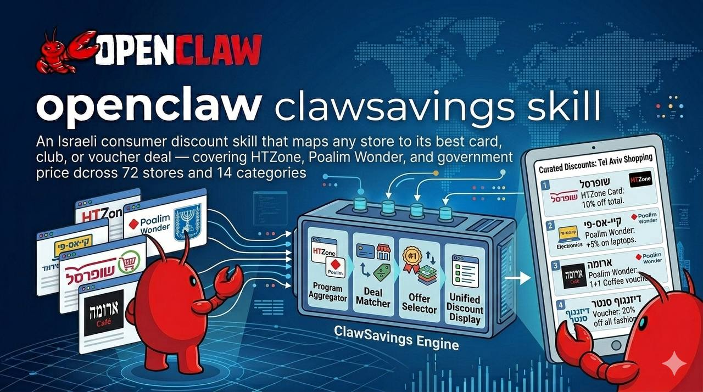

# clawsavings

An Israeli consumer discount skill that maps any store to its best card, club, or voucher deal — covering HTZone, Poalim Wonder, and government price data across 72 stores and 14 categories.

Part of the [OpenClaw](https://github.com/openclaw) skill ecosystem.

## What It Does

- **"Which card should I use at Victory?"** → ranked list of best deals with exact ₪ amounts
- **"Where's cheapest for milk?"** → supermarket ranking + gov price data reference
- **"Any Wolt discounts?"** → live voucher prices from verified sources

Hebrew-first. Designed for WhatsApp and Telegram group agents.

## Discount Sources

| Source | Type | Coverage | Auth Required |
|--------|------|----------|---------------|
| **HiTech Zone Card** (כאל) | POS discount at checkout | Food chains, pharma, restaurants, fashion, travel | Card required |
| **HiTech Zone Club** | Discounted vouchers | ~500 businesses across all categories | Login required |
| **HiTech Zone PRO²** | Cashback + shop discounts | HTZone site purchases, PRO² Shop | Login required |
| **Poalim Wonder** | Points → vouchers | Food chains, delivery, fashion, sports, gifts | Free signup |
| **Gov Price Transparency** | Full price comparison | All major supermarket chains (XML, daily) | None |

## Categories

| Category | Hebrew | Stores |
|----------|--------|--------|
| supermarkets | רשתות מזון | שופרסל, רמי לוי, ויקטורי, קרפור, שוק העיר, יינות ביתן + more |
| restaurants | מסעדות | ארומה, קפה לנדוור, קפה קפה, BBB, מוזס + more |
| delivery | משלוחים | וולט, תן ביס, סיבוס |
| pharma | פארם | סופר-פארם, ניופארם, גודפארם |
| fashion | אופנה | קסטרו, פוקס, גולף, ורדינון, SOHO + more |
| electronics | אלקטרוניקה | KSP, באג, איווורי, מחסני חשמל |
| entertainment | בילויים | יס פלאנט, סינמה סיטי, פלאנט, לב סינמה |
| gifts | מתנות | GiftZone, Love Gift Card, Dream Card |
| home_kitchen | בית ומטבח | איקאה, אייס, הום סנטר, סלטם |
| household_products | ניקיון | סנו |
| travel | תיירות | איסתא, בוקינג, מלונות פתאל |
| gym_sports | כושר | הולמס פלייס, דקטלון, מגה ספורט |
| fuel | דלק | פז, סונול, דלק |
| kids_baby | ילדים | שילב, טויס אר אס, בייבילנד |

## Architecture

### Two-Layer Knowledge Base

```
discounts.json
├── Structural layer  — which source covers which category, max % off
│                       near-static, update manually (quarterly)
│
└── Deal layer        — exact voucher prices (e.g. Victory ₪300 → ₪259)
                        cached_at timestamp, 30-day TTL
                        refreshed on-demand when stale
```

**Why two layers?** Structural data (HTZone covers supermarkets at up to 20%) barely changes. Specific voucher prices drift monthly. Separating them means 80% of queries are answered from near-free static data; only live lookups cost extra.

### Token-Efficient Loading

The agent loads only the relevant category section, not the full KB:

1. Read `quick_lookup.store_to_category` → identify category (~200 tokens)
2. Read only that category + source metadata (~800–1,200 tokens)

Result: ~75% fewer tokens vs loading the full file.

### On-Demand Cache Refresh

When `cached_at` is null or older than 30 days:
1. Answer immediately from structural data (`max_pct`)
2. If exact price needed → browser fetch → update `deals[]` + `cached_at` → save
3. Next request served from cache

## Installation

Copy to your OpenClaw skills directory:

```bash
cp -r clawsavings ~/.openclaw/workspace/skills/clawsavings
```

The skill is loaded automatically when the agent receives a discount-related query.

## Verified Deals (as of 2026-03-06)

A sample of the 24 verified Poalim Wonder deals in the KB:

| Store | Face Value | Price | Discount |
|-------|-----------|-------|----------|
| שוק העיר | ₪300 | ₪255 + 50pts | 15% |
| ויקטורי | ₪300 | ₪259 + 50pts | 13.7% |
| קרפור | ₪300 | ₪259 + 50pts | 13.7% |
| רמי לוי | ₪700 | ₪620 + 50pts | 11.4% |
| וולט | ₪100 | ₪80 + 25pts | 20% |
| קסטרו | ₪150 | ₪109 + 25pts | 27.3% |
| ורדינון | ₪100 | ₪65 + 25pts | 35% |
| סלטם | ₪100 | ₪60 + 25pts | 40% |
| מגה ספורט | ₪250 | ₪199 + 25pts | 20.4% |
| SOHO | ₪200 | ₪149 + 50pts | 25.5% |

## Updating the KB

### Quarterly (structural layer)
Check if HTZone or Poalim Wonder benefit structure changed. Update `max_pct` and `last_reviewed`.

### On-demand (deal layer)
```bash
python scripts/refresh_deals.py --source poalim_wonder
```
Or manually edit `discounts.json`: update `deals[]` array and set `cached_at` to today.

## Roadmap

- **Gov XML price integration** — product-level price comparison via [OpenIsraeliSupermarkets](https://github.com/OpenIsraeliSupermarkets/israeli-supermarket-scarpers)
- **HTZone deal automation** — browser refresh with saved session
- **Max / Isracard** — expand coverage to remaining major card programs

## File Structure

```
clawsavings/
├── SKILL.md              # Agent instructions + decision logic
├── discounts.json        # Knowledge base (structural + deal layers)
├── header.jpg            # Cover image
├── README.md             # This file
└── scripts/
    └── refresh_deals.py  # Deal refresh automation
```

## License

MIT
